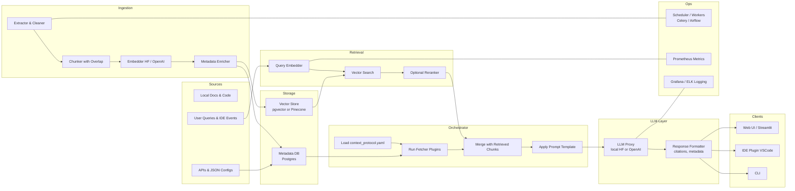
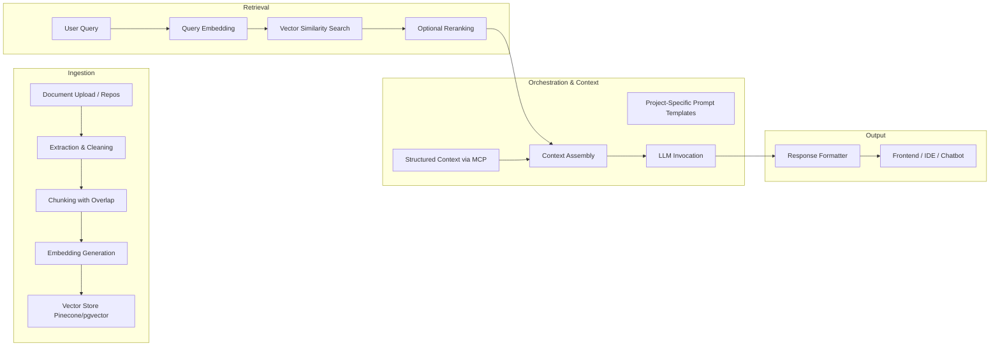

# Integrated RAG Pipeline Architecture



Component Overview
	•	Sources
	•	Local Docs & Code: Markdown, PDFs, code repositories.
	•	APIs & JSON Configs: Dynamic project metadata, KPIs, recent actions.
	•	User Queries & IDE Events: Input prompts from web, CLI, or editor.
	•	Ingestion
	1.	Extractor & Cleaner: Parse raw files (via PyMuPDF, Unstructured, python-docx).
	2.	Chunker: Split text into overlapping segments (~500 tokens).
	3.	Embedder: Compute semantic vectors using HF transformers or OpenAI embeddings.
	4.	Metadata Enricher: Tag each chunk (source, project, timestamp).
	•	Storage
	•	Vector Store: Efficient semantic search (pgvector in Postgres or Pinecone).
	•	Metadata DB: Relational store for chunk metadata, context config, and fetcher outputs.
	•	Retrieval
	•	Query Embedder: Embeds user queries with the same model as ingestion.
	•	Vector Search: Finds top-K relevant chunks via cosine similarity.
	•	Reranker: (Optional) Applies a cross-encoder to refine top hits.
	•	Context Orchestration
	•	context_protocol.yaml: Defines which static and dynamic data to include.
	•	Fetcher Plugins: Python modules that load local JSON, call internal APIs, compute KPIs.
	•	Assembler: Merges fetched data with retrieved chunks into a unified context.
	•	Prompt Templates: Jinja2 templates per use-case (IDE assistance, study tutor, model docs).
	•	LLM & Formatting
	•	LLM Proxy: Unified interface for local Hugging Face endpoints or OpenAI.
	•	Response Formatter: Attaches inline citations, enforces policies, and returns final text.
	•	Clients
	•	Web UI / Streamlit: Chat interfaces and dashboards.
	•	IDE Plugin: VSCode extension for in-editor code completions and refactors.
	•	CLI: Shell tool for ad-hoc queries and scripts.
	•	Observability & Ops
	•	Scheduler / Workers: Celery or Airflow to manage ingestion and periodic re-indexing.
	•	Metrics: Prometheus for query latency, ingestion throughput.
	•	Logging: Grafana or ELK stack for traces, errors, and operational health.

⸻

This architecture provides a clear, modular blueprint for building your unified RAG pipeline entirely on your local machine, while preserving the structured, dynamic-context capabilities inspired by MCP.



## Ingestion and Indexing

### Extraction and Cleaning

Use Unstructured.io or PyMuPDF to parse PDFs, code repos, and markdown docs into plain text.

### Chunking

• Apply a RecursiveCharacterTextSplitter with ~100-token overlap to preserve context boundaries .
• Tailor chunk sizes: smaller for code snippets (IDE use-case) and larger for long form docs (study assistant).


### Embedding

Leverage Hugging Face embedding models via transformers pipelines for batch embedding.  Store embeddings along with metadata in a Vector DB (Pinecone, Weaviate, pgvector)


## Retrieval & Reranking

Query Embedding
 • Mirror the ingestion embedding logic for user queries to ensure compatibility in semantic space .
Hybrid Similarity Search
 • Perform cosine similarity on vectors and optionally combine with keyword filters for precise code snippet lookup in the IDE .
Reranking
 • For high-value queries (e.g., study assistant explanations), apply a cross-encoder (e.g., Cohere Rerank) to the top-K hits to refine relevance before prompt assembly .


 Absolutely—let’s strip out the Foundry dependencies and show how you can run everything end-to-end on your local machine, while still preserving the spirit of MCP (Model Context Protocol) for structured, dynamic context assembly.

```mermaid
flowchart LR
    subgraph Local Ingestion
        A1[Local Docs, Code Repos, APIs] --> A2[Extraction & Cleaning Python]
        A2 --> A3[Chunking + Overlap]
        A3 --> A4[Embedding HF or OpenAI]
        A4 --> A5[Vector Store pgvector / Pinecone]
    end

    subgraph Local Retrieval
        Q[User Query] --> R1[Embed Query]
        R1 --> R2[Vector Similarity Search]
        R2 --> R3[Optional Reranking]
    end

    subgraph Context Orchestrator
        R3 --> O1[Assemble “MCP-like” Context]
        subgraph
          C1[context_protocol.yaml/json]
          C2[Fetcher Plugins Python]
        end
        C1 --> O1
        C2 --> O1
        O1 --> O2[Prompt Templating]
    end

    subgraph LLM & Output
        O2 --> LLM[LLM Invocation (HF/OpenAI)]
        LLM --> Formatter[Attach Citations & Metadata]
        Formatter --> UX[CLI / Web UI / IDE Plugin]
    end
```

⸻

Key Changes for a Fully Local Build
	1.	Local MCP-Style Context Protocol
	•	Config File: Define your context requirements in a simple context_protocol.yaml (or JSON) with sections like:

- name: “project_metadata”
  type: “static”
  source: “./configs/project_meta.json”
- name: “recent_actions”
  type: “dynamic”
  plugin: “fetch_recent_actions.py”
- name: “docs”
  type: “retrieved”
  top_k: 5


	•	Fetcher Plugins: Write small Python modules (e.g. fetch_recent_actions.py) that implement a standard interface:

def fetch(context, params):
    # load local JSON / call internal API / read a file
    return {...}


	•	At ingestion time, your orchestrator reads the config, runs each “static” or “dynamic” fetcher, and merges that data with the top-K retrieved chunks to form the full LLM context.

	2.	Simplified Ingestion Stack
	•	Extraction: Use open-source parsers (e.g. PyMuPDF, python-docx) to pull text from PDFs, Markdown, and code comments.
	•	Chunking & Embedding: Leverage LangChain’s TextSplitter and either Hugging Face’s sentence-transformers or OpenAI’s embeddings locally with your API key.
	•	Vector Store: Start with pgvector in a local Postgres instance, or spin up Pinecone/Weaviate in Docker.
	3.	Retrieval + Reranking
	•	Mirror your query embedding pipeline to obtain semantic vectors.
	•	For reranking, integrate a small cross-encoder (e.g. cross-encoder/ms-marco-MiniLM-L-6-v2) to reorder the top 10 candidates if needed.
	4.	Prompt Templating
	•	Maintain per-project Jinja2 templates in a prompts/ folder.
	•	Use a simple templating function:

from jinja2 import Environment, FileSystemLoader
env = Environment(loader=FileSystemLoader("prompts"))
tpl = env.get_template(f"{project}.j2")
prompt = tpl.render(context=assembled_context, query=user_query)


	5.	Deployment Locally
	•	API: FastAPI app with endpoints:
	•	POST /ingest (trigger docs → vector store)
	•	POST /query (embed → search → assemble → LLM → respond)
	•	UI/IDE:
	•	A minimal React frontend (or even Streamlit) that calls /query.
	•	Or build a VSCode extension that sends the current file context + query to your local API.

⸻

Next Steps for Local Proof-of-Concept
	1.	Scaffold a new Python project with Poetry or Conda.
	2.	Define your context_protocol.yaml for one use-case (e.g., the Study Assistant).
	3.	Write a simple extractor + chunker script to load one doc (e.g., study_assistant.md) and index in pgvector.
	4.	Implement a retrieval endpoint and a dummy fetcher plugin.
	5.	Wire up a prompt template and test an end-to-end query in a notebook or via curl.

Does this local-first, MCP-inspired approach align with what you had in mind?