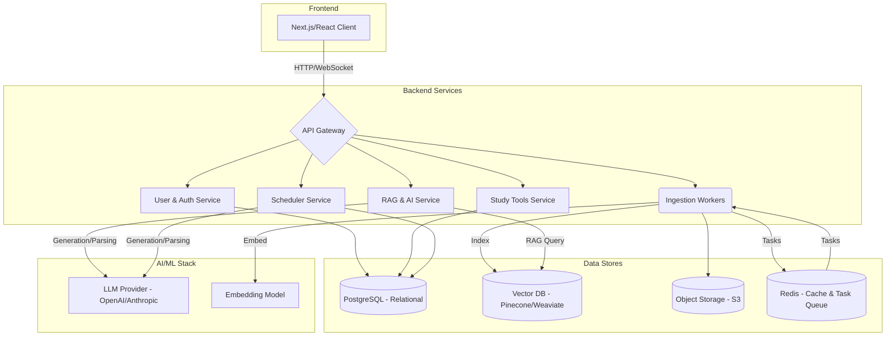

This is a comprehensive design for a full-stack AI/ML/LLM project: an AI-powered study assistant. This design outlines the architecture, technology stack, and implementation details for a robust and intelligent study aid, incorporating a RAG pipeline, flashcard generation, CRUD operations, note-taking, and automated study schedule generation.

### I. Project Overview and Vision

**Project Name:** IntelliStudy: The AI-Powered Study Assistant

**Goal:** To create an intelligent, integrated study platform that optimizes student learning by leveraging advanced AI/ML/LLM techniques for personalized study planning, efficient knowledge retrieval (RAG), and active recall mechanisms (flashcards and notes).

### II. System Architecture: Microservices

A microservices architecture is recommended for scalability, resilience, and independent development and deployment of services.



### III. Technology Stack

| Area | Technologies | Rationale |
| :--- | :--- | :--- |
| **Frontend** | Next.js (React), TypeScript, Tailwind CSS | Modern, performant (SSR), and scalable frontend development. |
| **Backend** | Python, FastAPI, Celery | High-performance, asynchronous framework (FastAPI) and distributed task queue (Celery), ideal for the Python AI ecosystem. |
| **Relational DB** | PostgreSQL | Robust, ACID-compliant database for structured data. |
| **Vector DB** | Pinecone, Weaviate, or pgvector | Efficient storage and retrieval of vector embeddings for semantic search. |
| **Storage & Cache**| AWS S3 (or equivalent), Redis | Durable object storage for documents; fast caching and message broker for task queues. |
| **LLM Provider** | OpenAI (GPT-4o) or Anthropic (Claude 3) | State-of-the-art models for generation, reasoning, and structured extraction. |
| **Embeddings** | OpenAI's `text-embedding-3` or Hugging Face models | High-quality vector representations of text. |
| **Orchestration** | LangChain or LlamaIndex | Frameworks for building and managing RAG pipelines. |
| **Document Parsing**| Unstructured.io, PyMuPDF | Efficient extraction of text from various document formats. |
| **Infrastructure** | Docker, Kubernetes, AWS/Azure/GCP | Containerization and orchestration for scalable deployment. |

### IV. Detailed Feature Implementation

#### A. RAG Pipeline: Ingestion and Retrieval

The RAG pipeline is the core knowledge engine of the assistant.

**1. Ingestion Pipeline (Asynchronous):**

1.  **Upload:** Users upload study materials. The Document Service stores the file in S3 and adds metadata to PostgreSQL.
2.  **Queueing:** A task is added to the Redis queue.
3.  **Processing (Celery Workers):**
    *   **Extraction:** `Unstructured.io` extracts text.
    *   **Chunking:** Text is split using advanced strategies (e.g., `RecursiveCharacterTextSplitter` with overlap) to maintain context.
    *   **Embedding:** An embedding model generates vector representations.
    *   **Indexing:** Embeddings and metadata are upserted into the Vector DB.

**2. Retrieval and Generation:**

1.  **Query Embedding:** The user's query is embedded.
2.  **Search:** Implement **Hybrid Search**, combining semantic (vector) search with keyword search.
3.  **Re-ranking (Recommended):** Use a re-ranking model (e.g., Cohere Rerank) to prioritize the most relevant retrieved chunks.
4.  **Prompt Augmentation:** The top-ranked chunks are added to the LLM prompt as context.
5.  **Generation:** The LLM generates a context-aware answer.

#### B. Automated Study Schedule Generation

This feature analyzes the syllabus and class schedule to create a personalized study plan.

1.  **Syllabus Parsing (Structured Extraction):**
    *   The syllabus (PDF/text) is ingested.
    *   We utilize advanced LLM capabilities (like OpenAI's JSON mode or function calling) to reliably extract structured data: Exam dates, assignment deadlines, weekly topics, and readings.
2.  **Schedule Generation (Algorithm/AI Agent):**
    *   A scheduling algorithm (potentially using a constraint satisfaction solver like Google OR-Tools, or an LLM-based planning agent) generates an optimized schedule.
    *   The algorithm considers deadlines, topic complexity, the user's schedule, and incorporates principles of spaced repetition for review sessions.

#### C. Flashcard Management (CRUD and AI Generation)

1.  **CRUD Operations:** Standard RESTful APIs in the Study Tools Service for managing flashcards and decks.
2.  **AI-Powered Generation:**
    *   Users select a document or note section.
    *   The LLM is prompted to identify key concepts, definitions, and Q&A pairs, returning them in JSON format.
3.  **Spaced Repetition System (SRS):** Implement an established SRS algorithm (e.g., SM-2) to optimize review intervals.

#### D. Note-Taking (CRUD and AI Enhancements)

1.  **Rich-Text Editor:** Implement a feature-rich editor (e.g., Tiptap or Slate.js) on the frontend.
2.  **CRUD Operations:** Standard RESTful APIs for note management, supporting organization and tagging.
3.  **AI Enhancements:**
    *   **Summarization:** LLM-powered summarization of notes.
    *   **Smart Linking:** Automatically suggesting links to related flashcards or documents based on semantic similarity (using the Vector DB).

### V. Database Schema

**PostgreSQL (Structured Data):**

*   `Users` (id, email, auth_provider_id)
*   `Courses` (id, user_id, name)
*   `Documents` (id, course_id, title, s3_key, type, status)
*   `ScheduleEvents` (id, course_id, event_type, title, start_time, end_time)
*   `Flashcards` (id, deck_id, question, answer, next_review_date, interval, ease_factor)
*   `Notes` (id, course_id, title, content_json)

**Vector Database (Embeddings):**

*   **Index/Collection**
    *   `Vector`: The numerical embedding.
    *   `Metadata`: `chunk_text`, `document_id`, `course_id`, `page_number`, `source_type`.

### VI. Deployment and LLMOps

A robust deployment and monitoring strategy is crucial for an AI application.

*   **Containerization and Orchestration:** Dockerize each microservice and use Kubernetes for orchestration, auto-scaling, and resilience.
*   **CI/CD:** Implement CI/CD pipelines (e.g., GitHub Actions) for automated testing and deployment.
*   **LLMOps (Monitoring and Evaluation):**
    *   **Performance Monitoring:** Monitor latency and error rates of all services (using Prometheus/Grafana).
    *   **RAG Evaluation:** Continuously evaluate the RAG pipeline's performance using frameworks like RAGAs or Evidently AI. Metrics should include retrieval relevance and answer quality (Faithfulness/Accuracy).
    *   **Prompt Monitoring and Cost:** Use tools like LangSmith to track prompt versions, latency, and costs associated with LLM calls.
    *   **Feedback Loop:** Implement mechanisms for users to provide feedback on AI generations to facilitate continuous improvement.
*   


This document outlines the architecture, implementation logic, and underlying academic concepts of the Retrieval-Augmented Generation (RAG) pipeline for the IntelliStudy assistant.

### I. Introduction to RAG

**Concept:** Retrieval-Augmented Generation (RAG) is an architectural pattern in Natural Language Processing (NLP) that enhances Large Language Models (LLMs) by grounding their responses in external, verifiable knowledge sources. Instead of relying solely on the LLM's internal (parametric) knowledge, RAG first retrieves relevant information from a knowledge base (like study materials) and then uses that information as context for the LLM to generate an answer.

**Academic Relevance:** RAG addresses critical limitations of standard LLMs:
1.  **Hallucination Reduction:** By grounding the LLM in specific context, RAG increases factual accuracy.
2.  **Knowledge Cut-off:** It allows the LLM to reason about private or recent data it was not trained on (e.g., a specific course textbook).
3.  **Explainability and Trust:** The system can cite the sources (retrieved documents) used to generate the answer.

### II. RAG Pipeline Architecture

The pipeline is divided into two main stages: Ingestion (offline processing) and Retrieval & Generation (online querying).

```mermaid
graph LR
    subgraph Stage 1: Ingestion (Offline)
        A[Documents/Syllabi] --> B(1. Extraction & Loading);
        B --> C(2. Chunking/Splitting);
        C --> D{3. Embedding Model};
        D --> E[(4. Vector Database)];
    end

    subgraph Stage 2: Retrieval & Generation (Online)
    Q[User Query] --> D;
    D -- Query Vector --> F(5. Similarity Search);
    E -- Stored Vectors --> F;
    F -- Top-K Chunks --> G(6. Reranking);
    G -- Top-N Chunks --> H(7. Prompt Augmentation);
    H --> I[LLM];
    I --> J[Answer];
    end
```

***

### III. Stage 1: Ingestion (Indexing Pipeline)

The ingestion stage prepares the study materials for efficient retrieval.

#### 1. Document Extraction and Loading

*   **Implementation:** Utilizing libraries like `Unstructured.io` or `PyMuPDF` to extract raw text from various formats (PDF, DOCX). This process runs asynchronously (e.g., using Celery workers in the backend).
*   **Logic:** To convert heterogeneous input formats into a unified, clean text format suitable for NLP processing.
*   **Academic Concept: Information Extraction (IE).** The process of transforming unstructured data into a machine-readable format, often involving noise reduction (removing headers/footers) and potentially OCR if documents are image-based.

#### 2. Chunking (Text Splitting)

*   **Implementation:** Using a `RecursiveCharacterTextSplitter` (common in frameworks like LangChain or LlamaIndex). This method tries to split text at logical boundaries (paragraphs, then sentences, then words). Crucially, **chunk overlap** (e.g., 100 tokens) is added between chunks to preserve context at the boundaries.
*   **Logic:** LLMs and embedding models have maximum input sizes (context windows). Large documents must be segmented to fit these constraints and to enable precise retrieval of relevant passages.
*   **Academic Concept: Context Window Optimization and Semantic Coherence.** Chunking seeks an optimal balance between granularity (for precise retrieval) and contextuality (ensuring the chunk makes sense independently).

#### 3. Embedding Generation

*   **Implementation:** Sending each chunk to an embedding model API (e.g., OpenAI's `text-embedding-3-large` or open-source models like `BAAI/bge-large-en`).
*   **Logic:** To convert the text into a numerical vector representation that captures its meaning.
*   **Academic Concept: Vector Space Models (VSMs) and the Distributional Hypothesis.** This relies on the idea that texts appearing in similar contexts have similar meanings. The embedding model maps the text into a high-dimensional "semantic space," where similar concepts are geometrically close.

#### 4. Indexing in the Vector Database

*   **Implementation:** Storing the generated vectors, the original text chunks, and metadata (e.g., `course_id`, `page_number`) in a specialized Vector Database (e.g., Pinecone, Weaviate, or PostgreSQL with `pgvector`).
*   **Logic:** To enable fast searching across a large corpus of vectors.
*   **Academic Concept: Approximate Nearest Neighbor (ANN) Search.** Exact search in high-dimensional spaces is computationally expensive. Vector databases use efficient indexing algorithms (like HNSW – Hierarchical Navigable Small Worlds) to perform fast, approximate similarity searches.

***

### IV. Stage 2: Retrieval and Generation Pipeline

This stage executes in real-time when the student asks a question.

#### 1. Query Embedding

*   **Implementation:** The user's query is embedded using the *exact same* model used during ingestion.
*   **Logic:** To compare the query with the stored documents, both must reside in the same latent semantic vector space.

#### 2. Retrieval (Similarity Search)

*   **Implementation:** The query vector is used to search the Vector DB for the Top-K (e.g., Top 10) most similar chunks. A robust implementation often uses **Hybrid Search**, combining dense vector search (semantic) with traditional keyword search (like BM25) to capture both general meaning and exact terminology.
*   **Logic:** To quickly identify the most relevant passages from the entire corpus.
*   **Academic Concept: Similarity Metrics.** Similarity is typically calculated using **Cosine Similarity**, which measures the angle between the query vector and the document vectors. This metric is preferred because it focuses on the orientation (meaning) rather than the magnitude (length) of the vectors.

#### 3. Reranking (Advanced RAG)

*   **Implementation:** The initial Top-K results are passed to a more sophisticated Cross-Encoder model (e.g., Cohere Rerank or `bge-reranker`). This model analyzes the query and the chunk together to produce a precise relevance score, after which the results are re-sorted to select the final Top-N (e.g., Top 3).
*   **Logic:** The initial retrieval (using Bi-encoders/embedding models) is fast but optimized for broad similarity. Reranking optimizes for precise relevance to the specific query intent.
*   **Academic Concept: Cross-Encoders vs. Bi-Encoders.** Bi-encoders process texts independently, making them fast for large-scale search. Cross-encoders process the query and document simultaneously, utilizing attention mechanisms between the two texts. This is slower but much more accurate for determining relevance.

#### 4. Prompt Augmentation

*   **Implementation:** The top N re-ranked chunks are combined with the original query and a system prompt.

```
System: You are an expert study assistant. Using ONLY the provided context, answer the student's question. Cite your sources.
Context:
[Source 1]: [Chunk 1]
[Source 2]: [Chunk 2]
User Question: [Original Query]
Answer:
```

*   **Logic:** Providing the LLM with specific, retrieved information to answer the user's question.
*   **Academic Concept: In-Context Learning (ICL).** This is the core of RAG. We leverage the LLM's ability to learn from its immediate input without requiring model fine-tuning.

#### 5. Generation

*   **Implementation:** The augmented prompt is sent to the main LLM (e.g., GPT-4o, Claude 3).
*   **Logic:** The LLM synthesizes the provided context to generate a coherent, accurate, and grounded response.
*   **Academic Concept: Grounding and Autoregressive Language Modeling.** By restricting the LLM to the provided context, we "ground" the response in the study materials, reducing hallucinations.

### V. Conceptual Python Implementation

The following Python code provides a simplified, conceptual illustration of the RAG flow using `pandas` and `sklearn` to simulate the vector database operations and mock the AI models.

